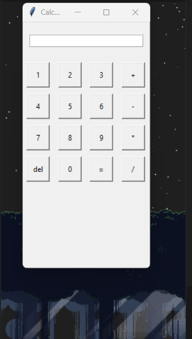

this will be how the calculator look like

lets try it out

viola lol 

next is the guess the number, well its self explanatory

heres a round i played :)

 

heres how the tic tac toe looks like 

it doesnt know when you win, planning to add that soon

welp then the good ol to do list

enter something the press add task

oh viola, its now at the listbox, it also gets saved at the .txt file 

if you ever want to remove a task, just press the task the the delete button :)